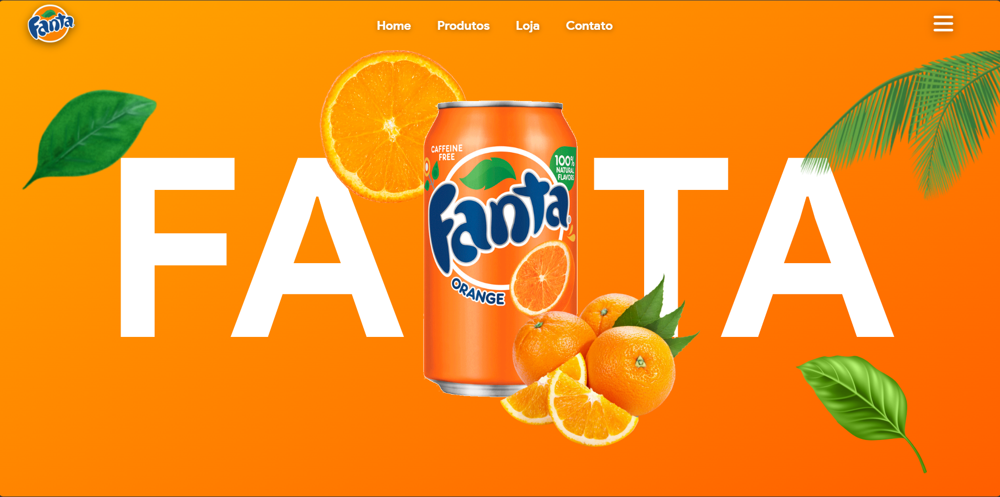
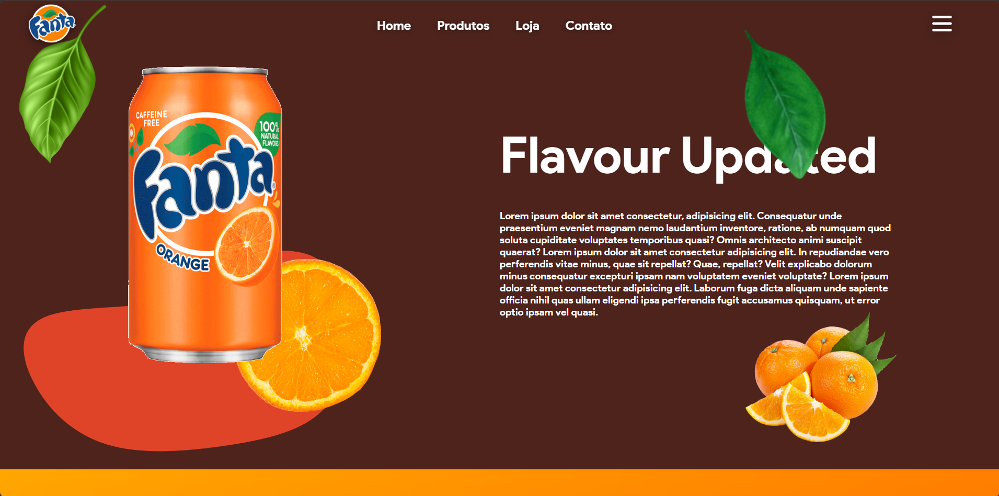
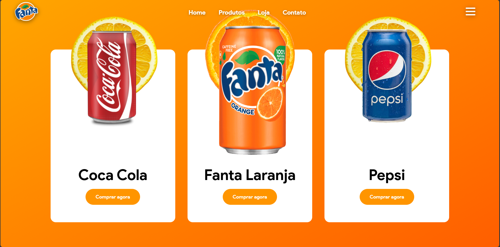

<div align="center">

# 🍊 Animated Landing Page

Landing page desenvolvida para praticar HTML, CSS, JavaScript e GSAP.

🚧 **Projeto em desenvolvimento**

### 🌐 Live Demo

👉 animated-landing-page-eosin-gamma.vercel.app

</div>

---

## 📖 Sobre o projeto

Este projeto foi desenvolvido durante meus estudos no curso de **Programação** do **O Rei Dos Sites**.

Após concluir o módulo de Front-End, decidi continuar evoluindo o projeto por conta própria, aplicando melhorias, refatorando o código e adicionando novas funcionalidades para aprofundar meus conhecimentos em desenvolvimento Front-End.

O objetivo é utilizar este projeto como uma forma de praticar conceitos importantes como:

- HTML semântico
- CSS moderno
- Flexbox
- Posicionamento de elementos
- JavaScript
- Animações com GSAP
- ScrollTrigger
- Organização e boas práticas de código

> **Observação:** Este projeto foi desenvolvido exclusivamente para fins de estudo e prática. Não é um site oficial.

---

# 📚 Minha jornada

Este projeto representa parte da minha evolução como desenvolvedor.

- ✅ Desenvolvido inicialmente durante o curso de **Programação** do **Herbert Souza (O Rei Dos Sites)**.
- 🔄 Curso em andamento.
- 🚀 Atualmente continuo aprimorando o projeto por conta própria, adicionando novas animações, refinando o layout, organizando melhor o código e aplicando conhecimentos adquiridos em estudos posteriores.

Meu objetivo é que este projeto acompanhe minha evolução como desenvolvedor e faça parte do meu portfólio.

---

# 🚀 Tecnologias utilizadas

<p align="center">
    
</p>

### Bibliotecas

- GSAP
- ScrollTrigger

---

# ✨ Funcionalidades

- ✅ Landing Page moderna
- ✅ Navbar fixa
- ✅ Hero Section
- ✅ Cards de produtos
- ✅ Animações durante o scroll
- ✅ Timeline com GSAP
- ✅ ScrollTrigger
- 🔄 Melhorias contínuas

---

# 📸 Preview

## Home

<p align="center">

</p>

---

## Sobre

<p align="center">

</p>

---

## Produtos

<p align="center">

</p>

---

# 📂 Estrutura do projeto

```text
📦 animated-landing-page
│
├── 📂 assets
├── 📂 fonts
├── 📂 preview
│   ├── home.png
│   ├── about.png
│   └── products.png
│
├── 📜 index.html
├── 📜 style.css
├── 📜 script.js
└── 📄 README.md
```

---

# 🎯 Objetivos de aprendizado

Durante o desenvolvimento deste projeto estou praticando e aprimorando meus conhecimentos em:

- HTML5
- CSS3
- JavaScript
- GSAP
- ScrollTrigger
- Flexbox
- Posicionamento absoluto
- Responsividade
- Organização de projetos
- Estruturação de código
- Versionamento com Git e GitHub

---

# 🚧 Próximas melhorias

Pretendo implementar:

- [ ] Responsividade para tablets e celulares
- [ ] Menu funcional
- [ ] Mais animações utilizando GSAP
- [ ] Efeitos de hover mais elaborados
- [ ] Melhor organização do CSS
- [ ] Otimização das imagens
- [ ] Melhor acessibilidade

---

# 🛠️ Ferramentas utilizadas

- Visual Studio Code
- Git
- GitHub
- Microsoft Edge
- GSAP

---

# 📈 Status do projeto

🟢 Em desenvolvimento.

O projeto continuará recebendo melhorias conforme eu evoluo meus conhecimentos em Front-End.

Caso queira visualizar o projeto em funcionamento, acesse:

👉 animated-landing-page-eosin-gamma.vercel.app

---

<div align="center">

### Desenvolvido por João Vitor 🚀

*"Cada projeto é uma oportunidade para aprender algo novo."*

</div>
